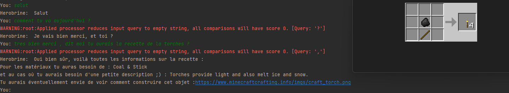

Pour fonctionner le programme a besoin de librairies externes vous pouvez les installer en lançant le script suivant.

    python3 setup.py

ou manuellement :

    pip install chatterbot==1.0.4
    pip install html5lib
    pip install beautifulsoup4
    pip install Pillow
    pip install fuzzywuzzy
    pip install soundex

Bien que les versions plus récentes de chatterbot soit disponible plusieurs problèmes peuvent survenir vous empêchant d'effectuer l'installation.

Une fois installer lancer le programme avec la commande suivante

    python3 main.py

Description :
le projet combine deux projets, un scraper et un chatbot.

Le scraper récupère les données des recettes minecraft si une nouvelle recette est disponible le scraper la récupérera automatiquement sans devoir changer le code.

Le chat bot utilise chatterbot pour communiquer avec l'utilisateur, il nécessite encore de l'entraînement, il se base sur des corpus pour interagir et répondre aux questions de l'utilisateur.

Quand l'utilisateur demande une recette une analyse Syntaxique et Phonétique est effectué cela permet de réduire les faux positifs ainsi demander la recette de là
Torche ou encore Torsh est correcte et donnera la bonne recette.

Example de dialogue :  

Les warnings de Query sont dus à la manière dont fuzzywuzzy traite les donnes de son analyse Syntaxique, mais cela ne change en rien le résultat.